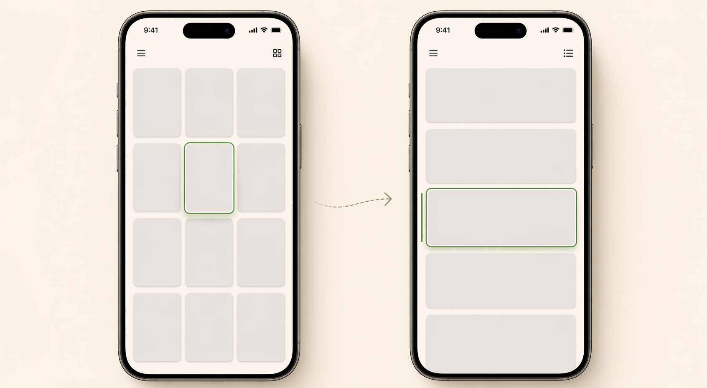

# bidirectional-infinite-scroll



Lightweight bidirectional infinite scroll

It uses standard web APIs such as `IntersectionObserver` and `scrollIntoView` instead of scroll listeners and manual `scrollTop` correction. The package currently exposes the React APIs `useBidirectionalScroll` and `FetchMore`.

[한국어 문서](./README.ko.md)

## Install

```bash
npm install @ahnandev/bidirectional-infinite-scroll
```

Live demo: [ahnandev.github.io/bidirectional-infinite-scroll](https://ahnandev.github.io/bidirectional-infinite-scroll/)

React support is smoke-tested against `16.14.0`, `17.0.2`, `18.3.1`, and `19.2.0`.

```bash
npm run test:react-matrix
npm run demo:react -- 16
```

## How To Use

### React

```tsx
import {
  FetchMore,
  useBidirectionalScroll,
} from "@ahnandev/bidirectional-infinite-scroll";

function Feed({
  items,
  anchorId,
  hasPreviousPage,
  hasNextPage,
  loadPrevious,
  loadNext,
}) {
  const { itemRef } = useBidirectionalScroll({
    anchorId,
  });

  return (
    <div>
      <FetchMore hasMore={hasPreviousPage} onIntersect={loadPrevious} />

      {items.map((item, index) => (
        <div key={item.id} ref={itemRef({ itemId: item.id, index })}>
          {item.title}
        </div>
      ))}

      <FetchMore hasMore={hasNextPage} onIntersect={loadNext} />
    </div>
  );
}
```

`useBidirectionalScroll`: React hook for bidirectional infinite scroll.

- `itemRef({ itemId, index })`: pass each item's id and index to the rendered item.
- optional) `anchorId`: use this when you want the list to start from a specific item.
- optional) `scrollOptions`: custom `scrollIntoView` options. Defaults to `{ behavior: 'instant', block: 'start' }`.
- optional) `safariCorrection`: enables double-rAF correction to reduce Safari layout shift. Defaults to `true`.
- optional) `FetchMore`: helper component. You can provide your own `IntersectionObserver` trigger if you prefer.
- optional) `anchorRef` and `firstItemRef`: low-level refs for manual control.

## License

MIT
